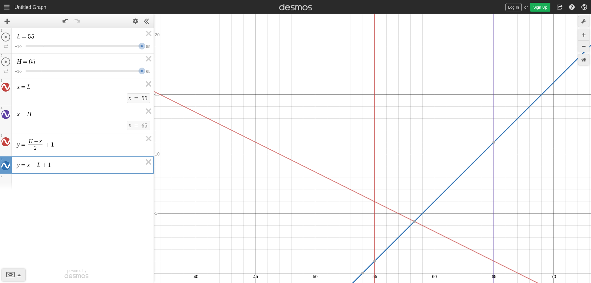

# Raspberry Pi automatic CPU fan control

## Dynamic sleep intervals

The farther away the CPU temperature is from the thresholds, the longer the
script sleeps.

X axis is temperature, Y axis is sleep time.

As the temperature rises, progressing from left to right, the sleep time (green line) steadily shortens at a slope of `Y = -X/2`. Once the temperature reaches the ON threshold (blue vertical line), then the fan is switched on and the sleep time is calculated at `Y = X` (blue line). The fan stays on until the temperature reaches the OFF threshold (red line), at which point the sleep time switches back to the shallow, negative slope.

